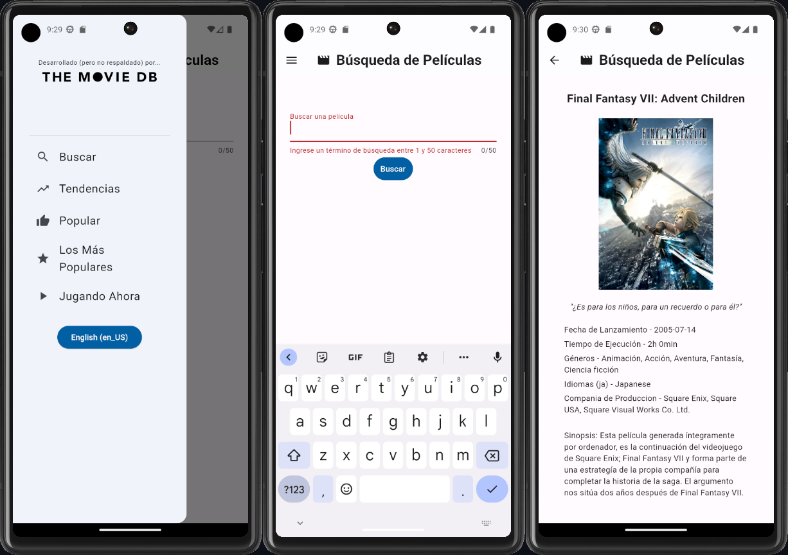

  # Flutter Movie Lookup
    
    
  Powered by the TMDB api, this Flutter/Dart application hosts a simple Android OS application that allows users to search for and view details of movies.
  
  ## Table of Contents
  * [Bonus Features](#features)
  * [Installation](#installation)
  * [Built With](#built)
  * [Usage Information](#usage)
  * [Authors & Acknowledgements](#credits)
  * [License](#license)
  * [Contact](#questions)
  
  ## Bonus Features
  This application also features bilingual language support for English (en-US) and Spanish (es-ES). (Translations unfortunately provided by Google Translate, please don't come for me 🥺)
  
  ## Installation
  To view this application, ensure that you have installed Android Studio. After cloning the repository, launch the emulator from VS Code using ctrl + shift + p and press f5 to run the application debug mode.
  
  ## Built With
  * Flutter
  * Dart
  * Android Studio
  * TMDB api
  * flutter_dotenv
  * flutter_svg
  * url_launcher
  * flutter_localizations
  * localization
  * flutter_riverpod

  ## Usage Information
  
  This application is a simple movie lookup app with a responsive layout. 
    
    
    
    
    
  
  ## Authors & Acknowledgements
  
  This application is powered but not endorsed or certified by the TMDB api. 
  Special thanks to ASH's answer [here](https://stackoverflow.com/questions/67920555/filenotfounderror-with-flutter-dotenv) on debugging .env errors 
  And Alexander's response [here](https://stackoverflow.com/questions/50923906/how-to-get-timezone-language-and-county-id-in-flutter-by-the-location-of-device) on retrieving the locale of the current device

  
  Made by [TOVTC](https://github.com/TOVTC).
  
  ## License
  This application uses the MIT License. For more information regarding usage, please visit [this link](https://opensource.org/licenses/MIT).
    
  ## Questions?
  Contact repository author via [GitHub](https://github.com/TOVTC). 
